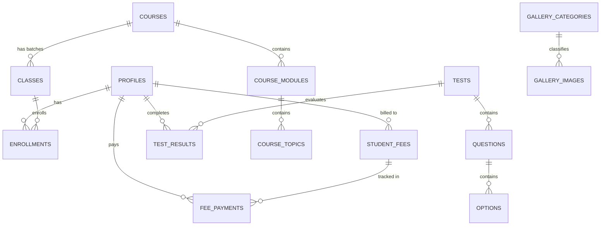
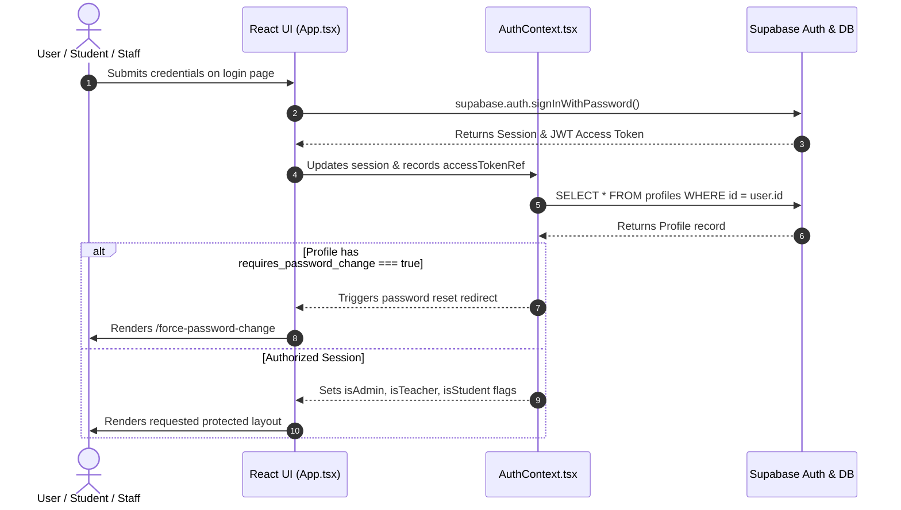
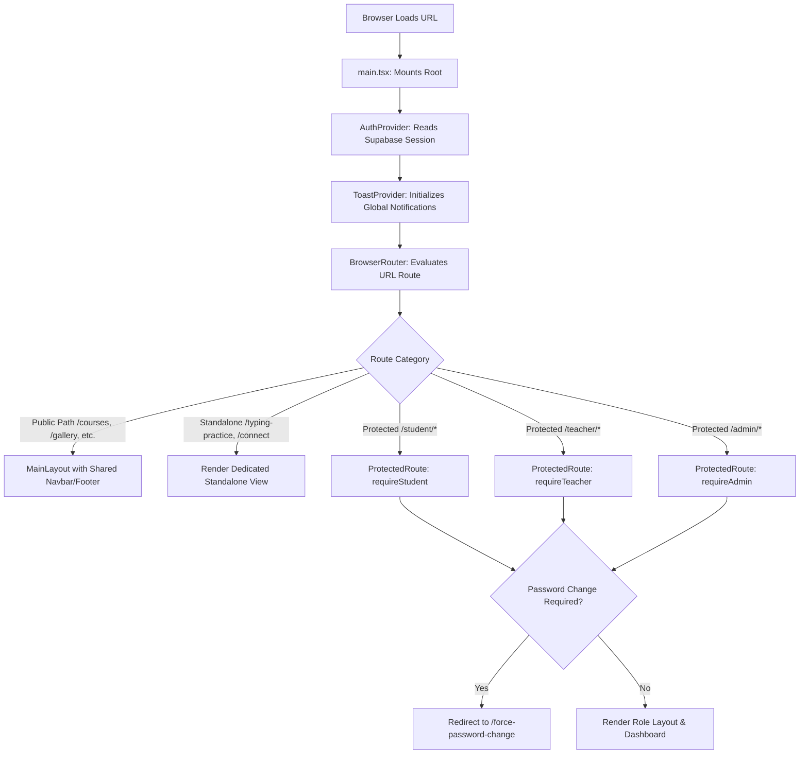
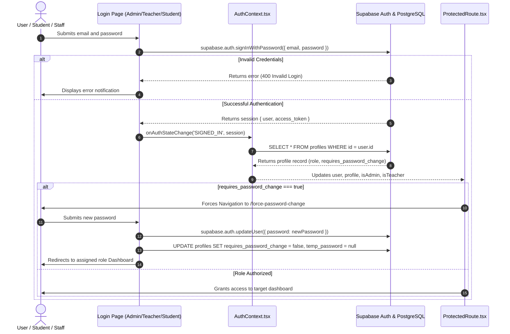
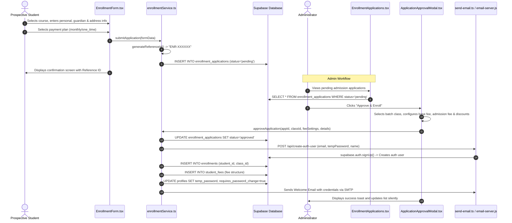
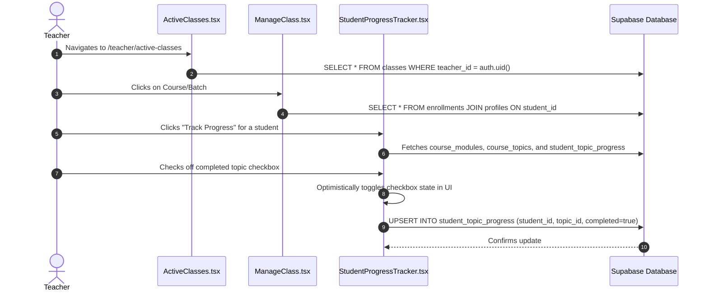
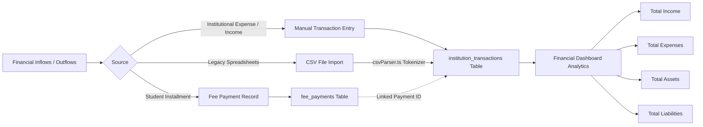
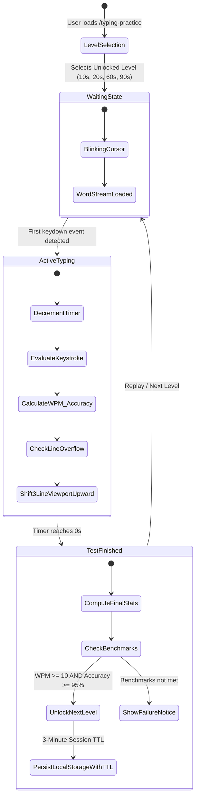

# ICST Connect — Complete System Architecture, Configuration & Technical Documentation

---

## 1. Executive Overview & System Vision

**ICST Connect** (`icstconnect`) is an enterprise-grade Institutional Management System (IMS), Educational Resource Planning (ERP) platform, and Public Web Portal built for the **Institute of Computer Science & Technology (ICST)**. 

Root Directory: `d:\VS Code\Project\icstconnect`

The platform unifies all institutional operations across four user personas:
1. **Public Prospective Students & Guests**: Course catalog discovery, online admission wizard, scholarship merit lists, interactive media galleries, social referral discount calculators, and speed typing practice.
2. **Enrolled Students**: Personal student portal, offline class timetables, fee tracking with gentle psychological reminder cards, progress tracking, academic calendars, and online examinations.
3. **Instructional Staff (Teachers)**: Assigned batch rosters, real-time attendance management, topic-by-topic student progress tracking, and examination evaluation.
4. **Institutional Management (Administrators)**: Comprehensive ERP covering admissions review with automated student account provisioning, curriculum hierarchy editing (drag-and-drop), timetable scheduling, institutional balance sheet ledger with CSV import, scholarship CMS, interactive gallery hotspot tagger, and MCQ test builder.

---

## 2. Master Technology Stack & Complete Configuration Reference

### 2.1 Technology Stack Summary
| Category | Technology | Version | Purpose |
| :--- | :--- | :--- | :--- |
| **Core Framework** | React | `^19.2.0` | UI Library with Concurrent Rendering |
| **Runtime & DOM** | React DOM | `^19.2.0` | DOM Rendering Engine |
| **Language** | TypeScript | `~5.9.3` | Static Type Safety & Compile-time validation |
| **Bundler & Dev Server** | Vite | `^8.0.7` | Fast HMR & Rollup-based Production Bundling |
| **Routing** | React Router DOM | `^7.10.0` | Client-side Declarative Routing & Layout Outlets |
| **CSS & Design Engine** | Tailwind CSS | `^4.1.17` | Utility-First CSS Framework (PostCSS 8 Engine) |
| **PostCSS Processor** | `@tailwindcss/postcss` | `^4.1.17` | PostCSS Plugin for Tailwind v4 |
| **Motion & Animation** | Framer Motion | `^12.23.26` | Physics-based animations & page transitions |
| **Icons** | Lucide React | `^0.561.0` | Modern SVG Icon Library |
| **Drag & Drop** | `@hello-pangea/dnd` | `^18.0.1` | Accessible Drag & Drop for Course Hierarchy Editor |
| **Date Calculations** | date-fns | `^4.1.0` | Immutable, lightweight date manipulation |
| **Database & Auth (BaaS)** | `@supabase/supabase-js` | `^2.86.2` | PostgreSQL DB, RLS Auth & Realtime Subscriptions |
| **Serverless Functions** | `@netlify/functions` | `^5.1.1` | Serverless Function Handlers for Netlify |
| **Local Backend & Relay** | Express | `^5.2.1` | Local SMTP and User Creation Relay Server |
| **Email Transport** | Nodemailer | `^8.0.5` | SMTP Email Delivery Engine |
| **Process Concurrency** | Concurrently | `^9.2.1` | Simultaneous Execution of Vite & Email Server |
| **CORS Middleware** | Cors | `^2.8.6` | Cross-Origin Resource Sharing for Local Express API |
| **Env Parser** | Dotenv | `^17.4.1` | Loads `.env` configuration into `process.env` |

---

### 2.2 Complete Build & Tooling Configuration Files

#### 1. Vite Configuration
- **File**: [`d:/VS Code/Project/icstconnect/vite.config.ts`](file:///d:/VS%20Code/Project/icstconnect/vite.config.ts)
- **Role**: Bundling, React fast-refresh plugin, and manual chunk splitting optimization for optimized caching:
```typescript
import { defineConfig } from 'vite'
import react from '@vitejs/plugin-react'

// https://vite.dev/config/
export default defineConfig({
  plugins: [react()],
  build: {
    rollupOptions: {
      output: {
        manualChunks: (id) => {
          if (id.includes('node_modules/react') || id.includes('node_modules/react-dom') || id.includes('node_modules/react-router-dom')) {
            return 'vendor-react';
          }
          if (id.includes('node_modules/framer-motion') || id.includes('node_modules/lucide-react')) {
            return 'vendor-ui';
          }
          if (id.includes('node_modules/@supabase/supabase-js')) {
            return 'vendor-supabase';
          }
        }
      }
    }
  }
})
```

#### 2. Root TypeScript Configuration
- **File**: [`d:/VS Code/Project/icstconnect/tsconfig.json`](file:///d:/VS%20Code/Project/icstconnect/tsconfig.json)
- **Role**: Composite project reference container pointing to client application and node build tooling configs:
```json
{
  "files": [],
  "references": [
    { "path": "./tsconfig.app.json" },
    { "path": "./tsconfig.node.json" }
  ]
}
```

#### 3. Client Application TypeScript Configuration
- **File**: [`d:/VS Code/Project/icstconnect/tsconfig.app.json`](file:///d:/VS%20Code/Project/icstconnect/tsconfig.app.json)
- **Role**: Defines ES2022 compilation targets, strict type enforcement, bundler module resolution, and JSX transformation:
```json
{
  "compilerOptions": {
    "tsBuildInfoFile": "./node_modules/.tmp/tsconfig.app.tsbuildinfo",
    "target": "ES2022",
    "useDefineForClassFields": true,
    "lib": ["ES2022", "DOM", "DOM.Iterable"],
    "module": "ESNext",
    "types": ["vite/client"],
    "skipLibCheck": true,

    /* Bundler mode */
    "moduleResolution": "bundler",
    "allowImportingTsExtensions": true,
    "verbatimModuleSyntax": true,
    "moduleDetection": "force",
    "noEmit": true,
    "jsx": "react-jsx",

    /* Linting */
    "strict": true,
    "noUnusedLocals": true,
    "noUnusedParameters": true,
    "erasableSyntaxOnly": true,
    "noFallthroughCasesInSwitch": true,
    "noUncheckedSideEffectImports": true
  },
  "include": ["src"]
}
```

#### 4. Node Tooling TypeScript Configuration
- **File**: [`d:/VS Code/Project/icstconnect/tsconfig.node.json`](file:///d:/VS%20Code/Project/icstconnect/tsconfig.node.json)
- **Role**: Defines ES2023 compilation for configuration files (such as `vite.config.ts`):
```json
{
  "compilerOptions": {
    "tsBuildInfoFile": "./node_modules/.tmp/tsconfig.node.tsbuildinfo",
    "target": "ES2023",
    "lib": ["ES2023"],
    "module": "ESNext",
    "types": ["node"],
    "skipLibCheck": true,
    "moduleResolution": "bundler",
    "allowImportingTsExtensions": true,
    "verbatimModuleSyntax": true,
    "moduleDetection": "force",
    "noEmit": true,
    "strict": true,
    "noUnusedLocals": true,
    "noUnusedParameters": true,
    "erasableSyntaxOnly": true,
    "noFallthroughCasesInSwitch": true,
    "noUncheckedSideEffectImports": true
  },
  "include": ["vite.config.ts"]
}
```

#### 5. PostCSS Configuration
- **File**: [`d:/VS Code/Project/icstconnect/postcss.config.js`](file:///d:/VS%20Code/Project/icstconnect/postcss.config.js)
- **Role**: Bridges Tailwind CSS v4 processing pipeline:
```javascript
export default {
    plugins: {
        '@tailwindcss/postcss': {},
    },
}
```

#### 6. ESLint 9 Configuration (Flat Config)
- **File**: [`d:/VS Code/Project/icstconnect/eslint.config.js`](file:///d:/VS%20Code/Project/icstconnect/eslint.config.js)
- **Role**: Lints modern TypeScript, React Hooks, and React Refresh rules:
```javascript
import js from '@eslint/js'
import globals from 'globals'
import reactHooks from 'eslint-plugin-react-hooks'
import reactRefresh from 'eslint-plugin-react-refresh'
import tseslint from 'typescript-eslint'
import { defineConfig, globalIgnores } from 'eslint/config'

export default defineConfig([
  globalIgnores(['dist']),
  {
    files: ['**/*.{ts,tsx}'],
    extends: [
      js.configs.recommended,
      tseslint.configs.recommended,
      reactHooks.configs.flat.recommended,
      reactRefresh.configs.vite,
    ],
    languageOptions: {
      ecmaVersion: 2020,
      globals: globals.browser,
    },
  },
])
```

#### 7. Netlify Deployment Configuration
- **File**: [`d:/VS Code/Project/icstconnect/netlify.toml`](file:///d:/VS%20Code/Project/icstconnect/netlify.toml)
- **Role**: Configures single-page application (SPA) fallback routing, esbuild serverless bundler, and build outputs:
```toml
[build]
  command = "npm run build"
  publish = "dist"

[functions]
  node_bundler = "esbuild"
  directory = "netlify/functions"

[[redirects]]
  from = "/*"
  to = "/index.html"
  status = 200
```

#### 8. NPM Scripts & Manifest
- **File**: [`d:/VS Code/Project/icstconnect/package.json`](file:///d:/VS%20Code/Project/icstconnect/package.json)
- **Scripts**:
  - `npm run dev`: Boots Vite development server on `http://localhost:5173`.
  - `npm run email`: Boots Express SMTP relay server on `http://localhost:5000`.
  - `npm run dev:all`: Concurrently launches both Vite and the Email Relay server.
  - `npm run build`: Typechecks using `tsc -b` and builds production bundle in `dist/`.
  - `npm run lint`: Runs ESLint across all TypeScript/React source files.
  - `npm run preview`: Locally serves the built production bundle for testing.

---

### 2.3 Environment Variables Reference (`.env`)
- **File**: [`d:/VS Code/Project/icstconnect/.env`](file:///d:/VS%20Code/Project/icstconnect/.env)

| Variable Name | Required By | Description / Purpose |
| :--- | :--- | :--- |
| `VITE_SUPABASE_URL` | Frontend & Email Server | Supabase project API base URL (e.g. `https://xyz.supabase.co`) |
| `VITE_SUPABASE_ANON_KEY` | Frontend & Email Server | Public Anonymous Supabase API Key (Used with RLS) |
| `VITE_CLOUDINARY_CLOUD_NAME`| Media Services (`cloudinary.ts`) | Cloudinary Cloud Name for unsigned direct image uploads |
| `VITE_CLOUDINARY_UPLOAD_PRESET`| Media Services (`cloudinary.ts`) | Unsigned upload preset configured in Cloudinary Dashboard |
| `SMTP_HOST` | Email Server & Netlify Function | SMTP server host (Default: `smtp.gmail.com`) |
| `SMTP_PORT` | Email Server & Netlify Function | SMTP server port (`465` for SSL, `587` for TLS) |
| `SMTP_USER` | Email Server & Netlify Function | Authenticated mailbox email address |
| `SMTP_PASS` | Email Server & Netlify Function | SMTP password or Google App Password |
| `SMTP_FROM` | Email Server & Netlify Function | Sender displayName and address (e.g., `"ICST Connect <noreply@icstconnect.com>"`) |

---

## 3. Complete File & Folder Hierarchy (With Absolute Paths)

```
d:/VS Code/Project/icstconnect/
│
├── Configuration & Build Files
│   ├── [d:/VS Code/Project/icstconnect/.env](file:///d:/VS%20Code/Project/icstconnect/.env)
│   ├── [d:/VS Code/Project/icstconnect/.gitignore](file:///d:/VS%20Code/Project/icstconnect/.gitignore)
│   ├── [d:/VS Code/Project/icstconnect/package.json](file:///d:/VS%20Code/Project/icstconnect/package.json)
│   ├── [d:/VS Code/Project/icstconnect/package-lock.json](file:///d:/VS%20Code/Project/icstconnect/package-lock.json)
│   ├── [d:/VS Code/Project/icstconnect/vite.config.ts](file:///d:/VS%20Code/Project/icstconnect/vite.config.ts)
│   ├── [d:/VS Code/Project/icstconnect/tsconfig.json](file:///d:/VS%20Code/Project/icstconnect/tsconfig.json)
│   ├── [d:/VS Code/Project/icstconnect/tsconfig.app.json](file:///d:/VS%20Code/Project/icstconnect/tsconfig.app.json)
│   ├── [d:/VS Code/Project/icstconnect/tsconfig.node.json](file:///d:/VS%20Code/Project/icstconnect/tsconfig.node.json)
│   ├── [d:/VS Code/Project/icstconnect/postcss.config.js](file:///d:/VS%20Code/Project/icstconnect/postcss.config.js)
│   ├── [d:/VS Code/Project/icstconnect/eslint.config.js](file:///d:/VS%20Code/Project/icstconnect/eslint.config.js)
│   ├── [d:/VS Code/Project/icstconnect/netlify.toml](file:///d:/VS%20Code/Project/icstconnect/netlify.toml)
│   ├── [d:/VS Code/Project/icstconnect/index.html](file:///d:/VS%20Code/Project/icstconnect/index.html)
│   └── [d:/VS Code/Project/icstconnect/email-server.js](file:///d:/VS%20Code/Project/icstconnect/email-server.js)
│
├── Documentation & Blueprints
│   ├── [d:/VS Code/Project/icstconnect/docs/PROJECT_RULES.md](file:///d:/VS%20Code/Project/icstconnect/docs/PROJECT_RULES.md)
│   ├── [d:/VS Code/Project/icstconnect/docs/PAYMENT_README.md](file:///d:/VS%20Code/Project/icstconnect/docs/PAYMENT_README.md)
│   └── [d:/VS Code/Project/icstconnect/docs/typing-practice.md](file:///d:/VS%20Code/Project/icstconnect/docs/typing-practice.md)
│
├── Serverless Backend Functions
│   └── [d:/VS Code/Project/icstconnect/netlify/functions/send-email.ts](file:///d:/VS%20Code/Project/icstconnect/netlify/functions/send-email.ts)
│
├── Database SQL Migrations & Schemas
│   ├── [d:/VS Code/Project/icstconnect/database/supabase_migration.sql](file:///d:/VS%20Code/Project/icstconnect/database/supabase_migration.sql)
│   ├── [d:/VS Code/Project/icstconnect/database/update_full_schema.sql](file:///d:/VS%20Code/Project/icstconnect/database/update_full_schema.sql)
│   ├── [d:/VS Code/Project/icstconnect/database/create_test_system.sql](file:///d:/VS%20Code/Project/icstconnect/database/create_test_system.sql)
│   ├── [d:/VS Code/Project/icstconnect/database/gallery_schema.sql](file:///d:/VS%20Code/Project/icstconnect/database/gallery_schema.sql)
│   ├── [d:/VS Code/Project/icstconnect/database/finance_schema_update.sql](file:///d:/VS%20Code/Project/icstconnect/database/finance_schema_update.sql)
│   ├── [d:/VS Code/Project/icstconnect/database/csv_schema_update.sql](file:///d:/VS%20Code/Project/icstconnect/database/csv_schema_update.sql)
│   ├── [d:/VS Code/Project/icstconnect/database/fix_classes_schema.sql](file:///d:/VS%20Code/Project/icstconnect/database/fix_classes_schema.sql)
│   ├── [d:/VS Code/Project/icstconnect/database/fix_profile_updates.sql](file:///d:/VS%20Code/Project/icstconnect/database/fix_profile_updates.sql)
│   ├── [d:/VS Code/Project/icstconnect/database/fix_profile_updates_v2.sql](file:///d:/VS%20Code/Project/icstconnect/database/fix_profile_updates_v2.sql)
│   ├── [d:/VS Code/Project/icstconnect/database/fix_rls_policies.sql](file:///d:/VS%20Code/Project/icstconnect/database/fix_rls_policies.sql)
│   ├── [d:/VS Code/Project/icstconnect/database/fix_user_deletion_cascade.sql](file:///d:/VS%20Code/Project/icstconnect/database/fix_user_deletion_cascade.sql)
│   ├── [d:/VS Code/Project/icstconnect/database/guardian_migration.sql](file:///d:/VS%20Code/Project/icstconnect/database/guardian_migration.sql)
│   ├── [d:/VS Code/Project/icstconnect/database/repair_course_schema.sql](file:///d:/VS%20Code/Project/icstconnect/database/repair_course_schema.sql)
│   ├── [d:/VS Code/Project/icstconnect/enrollment_migration.sql](file:///d:/VS%20Code/Project/icstconnect/enrollment_migration.sql)
│   ├── [d:/VS Code/Project/icstconnect/scholarship_migration.sql](file:///d:/VS%20Code/Project/icstconnect/scholarship_migration.sql)
│   └── [d:/VS Code/Project/icstconnect/password_migration.sql](file:///d:/VS%20Code/Project/icstconnect/password_migration.sql)
│
└── Source Application (`src/`)
    ├── Core Entry & Styles
    │   ├── [d:/VS Code/Project/icstconnect/src/main.tsx](file:///d:/VS%20Code/Project/icstconnect/src/main.tsx)
    │   ├── [d:/VS Code/Project/icstconnect/src/App.tsx](file:///d:/VS%20Code/Project/icstconnect/src/App.tsx)
    │   └── [d:/VS Code/Project/icstconnect/src/index.css](file:///d:/VS%20Code/Project/icstconnect/src/index.css)
    │
    ├── Global Contexts & State
    │   ├── [d:/VS Code/Project/icstconnect/src/contexts/AuthContext.tsx](file:///d:/VS%20Code/Project/icstconnect/src/contexts/AuthContext.tsx)
    │   └── [d:/VS Code/Project/icstconnect/src/contexts/ToastContext.tsx](file:///d:/VS%20Code/Project/icstconnect/src/contexts/ToastContext.tsx)
    │
    ├── Services & API Integrations
    │   ├── [d:/VS Code/Project/icstconnect/src/services/api.ts](file:///d:/VS%20Code/Project/icstconnect/src/services/api.ts)
    │   ├── [d:/VS Code/Project/icstconnect/src/services/courseService.ts](file:///d:/VS%20Code/Project/icstconnect/src/services/courseService.ts)
    │   ├── [d:/VS Code/Project/icstconnect/src/services/enrollmentService.ts](file:///d:/VS%20Code/Project/icstconnect/src/services/enrollmentService.ts)
    │   ├── [d:/VS Code/Project/icstconnect/src/services/feesService.ts](file:///d:/VS%20Code/Project/icstconnect/src/services/feesService.ts)
    │   ├── [d:/VS Code/Project/icstconnect/src/services/financeService.ts](file:///d:/VS%20Code/Project/icstconnect/src/services/financeService.ts)
    │   ├── [d:/VS Code/Project/icstconnect/src/services/scholarshipService.ts](file:///d:/VS%20Code/Project/icstconnect/src/services/scholarshipService.ts)
    │   └── [d:/VS Code/Project/icstconnect/src/services/emailService.ts](file:///d:/VS%20Code/Project/icstconnect/src/services/emailService.ts)
    │
    ├── External SDK Clients
    │   ├── [d:/VS Code/Project/icstconnect/src/lib/supabase.ts](file:///d:/VS%20Code/Project/icstconnect/src/lib/supabase.ts)
    │   └── [d:/VS Code/Project/icstconnect/src/lib/cloudinary.ts](file:///d:/VS%20Code/Project/icstconnect/src/lib/cloudinary.ts)
    │
    ├── TypeScript Type Definitions
    │   ├── [d:/VS Code/Project/icstconnect/src/types/index.ts](file:///d:/VS%20Code/Project/icstconnect/src/types/index.ts)
    │   ├── [d:/VS Code/Project/icstconnect/src/types/supabase.ts](file:///d:/VS%20Code/Project/icstconnect/src/types/supabase.ts)
    │   ├── [d:/VS Code/Project/icstconnect/src/types/course.ts](file:///d:/VS%20Code/Project/icstconnect/src/types/course.ts)
    │   └── [d:/VS Code/Project/icstconnect/src/types/scholarship.ts](file:///d:/VS%20Code/Project/icstconnect/src/types/scholarship.ts)
    │
    ├── Utilities & Helpers
    │   ├── [d:/VS Code/Project/icstconnect/src/utils/cn.ts](file:///d:/VS%20Code/Project/icstconnect/src/utils/cn.ts)
    │   ├── [d:/VS Code/Project/icstconnect/src/utils/csvParser.ts](file:///d:/VS%20Code/Project/icstconnect/src/utils/csvParser.ts)
    │   ├── [d:/VS Code/Project/icstconnect/src/utils/iconMapper.ts](file:///d:/VS%20Code/Project/icstconnect/src/utils/iconMapper.ts)
    │   └── [d:/VS Code/Project/icstconnect/src/utils/testIcons.ts](file:///d:/VS%20Code/Project/icstconnect/src/utils/testIcons.ts)
    │
    ├── Configuration
    │   └── [d:/VS Code/Project/icstconnect/src/config/navigation.ts](file:///d:/VS%20Code/Project/icstconnect/src/config/navigation.ts)
    │
    ├── Public & General Pages
    │   ├── [d:/VS Code/Project/icstconnect/src/pages/Home.tsx](file:///d:/VS%20Code/Project/icstconnect/src/pages/Home.tsx)
    │   ├── [d:/VS Code/Project/icstconnect/src/pages/Courses.tsx](file:///d:/VS%20Code/Project/icstconnect/src/pages/Courses.tsx)
    │   ├── [d:/VS Code/Project/icstconnect/src/pages/EnrollmentForm.tsx](file:///d:/VS%20Code/Project/icstconnect/src/pages/EnrollmentForm.tsx)
    │   ├── [d:/VS Code/Project/icstconnect/src/pages/Scholarships.tsx](file:///d:/VS%20Code/Project/icstconnect/src/pages/Scholarships.tsx)
    │   ├── [d:/VS Code/Project/icstconnect/src/pages/OnlineTest.tsx](file:///d:/VS%20Code/Project/icstconnect/src/pages/OnlineTest.tsx)
    │   ├── [d:/VS Code/Project/icstconnect/src/pages/TestPlayer.tsx](file:///d:/VS%20Code/Project/icstconnect/src/pages/TestPlayer.tsx)
    │   ├── [d:/VS Code/Project/icstconnect/src/pages/Gallery.tsx](file:///d:/VS%20Code/Project/icstconnect/src/pages/Gallery.tsx)
    │   ├── [d:/VS Code/Project/icstconnect/src/pages/TypingPractice.tsx](file:///d:/VS%20Code/Project/icstconnect/src/pages/TypingPractice.tsx)
    │   ├── [d:/VS Code/Project/icstconnect/src/pages/Connect.tsx](file:///d:/VS%20Code/Project/icstconnect/src/pages/Connect.tsx)
    │   ├── [d:/VS Code/Project/icstconnect/src/pages/Connect/DiscountForm.tsx](file:///d:/VS%20Code/Project/icstconnect/src/pages/Connect/DiscountForm.tsx)
    │   ├── [d:/VS Code/Project/icstconnect/src/pages/AboutUs.tsx](file:///d:/VS%20Code/Project/icstconnect/src/pages/AboutUs.tsx)
    │   ├── [d:/VS Code/Project/icstconnect/src/pages/Notifications.tsx](file:///d:/VS%20Code/Project/icstconnect/src/pages/Notifications.tsx)
    │   ├── [d:/VS Code/Project/icstconnect/src/pages/AdminLogin.tsx](file:///d:/VS%20Code/Project/icstconnect/src/pages/AdminLogin.tsx)
    │   ├── [d:/VS Code/Project/icstconnect/src/pages/TeacherLogin.tsx](file:///d:/VS%20Code/Project/icstconnect/src/pages/TeacherLogin.tsx)
    │   ├── [d:/VS Code/Project/icstconnect/src/pages/ResetPassword.tsx](file:///d:/VS%20Code/Project/icstconnect/src/pages/ResetPassword.tsx)
    │   └── [d:/VS Code/Project/icstconnect/src/pages/ForcePasswordChange.tsx](file:///d:/VS%20Code/Project/icstconnect/src/pages/ForcePasswordChange.tsx)
    │
    ├── Student Portal (`src/student/`)
    │   ├── Layout
    │   │   └── [d:/VS Code/Project/icstconnect/src/student/layout/StudentLayout.tsx](file:///d:/VS%20Code/Project/icstconnect/src/student/layout/StudentLayout.tsx)
    │   └── Pages
    │       ├── [d:/VS Code/Project/icstconnect/src/student/pages/Dashboard.tsx](file:///d:/VS%20Code/Project/icstconnect/src/student/pages/Dashboard.tsx)
    │       ├── [d:/VS Code/Project/icstconnect/src/student/pages/OfflineClasses.tsx](file:///d:/VS%20Code/Project/icstconnect/src/student/pages/OfflineClasses.tsx)
    │       ├── [d:/VS Code/Project/icstconnect/src/student/pages/Calendar.tsx](file:///d:/VS%20Code/Project/icstconnect/src/student/pages/Calendar.tsx)
    │       ├── [d:/VS Code/Project/icstconnect/src/student/pages/StudentFees.tsx](file:///d:/VS%20Code/Project/icstconnect/src/student/pages/StudentFees.tsx)
    │       └── [d:/VS Code/Project/icstconnect/src/student/pages/CompleteProfile.tsx](file:///d:/VS%20Code/Project/icstconnect/src/student/pages/CompleteProfile.tsx)
    │
    ├── Teacher Portal (`src/teacher/`)
    │   ├── Layout
    │   │   └── [d:/VS Code/Project/icstconnect/src/teacher/layout/TeacherLayout.tsx](file:///d:/VS%20Code/Project/icstconnect/src/teacher/layout/TeacherLayout.tsx)
    │   └── Pages
    │       ├── [d:/VS Code/Project/icstconnect/src/teacher/pages/Dashboard.tsx](file:///d:/VS%20Code/Project/icstconnect/src/teacher/pages/Dashboard.tsx)
    │       ├── [d:/VS Code/Project/icstconnect/src/teacher/pages/ActiveClasses.tsx](file:///d:/VS%20Code/Project/icstconnect/src/teacher/pages/ActiveClasses.tsx)
    │       ├── [d:/VS Code/Project/icstconnect/src/teacher/pages/ManageClass.tsx](file:///d:/VS%20Code/Project/icstconnect/src/teacher/pages/ManageClass.tsx)
    │       ├── [d:/VS Code/Project/icstconnect/src/teacher/pages/StudentProgressTracker.tsx](file:///d:/VS%20Code/Project/icstconnect/src/teacher/pages/StudentProgressTracker.tsx)
    │       ├── [d:/VS Code/Project/icstconnect/src/teacher/pages/Calendar.tsx](file:///d:/VS%20Code/Project/icstconnect/src/teacher/pages/Calendar.tsx)
    │       └── [d:/VS Code/Project/icstconnect/src/teacher/pages/Exams.tsx](file:///d:/VS%20Code/Project/icstconnect/src/teacher/pages/Exams.tsx)
    │
    ├── Admin Portal (`src/admin/`)
    │   ├── Components
    │   │   ├── [d:/VS Code/Project/icstconnect/src/admin/components/AddTransactionModal.tsx](file:///d:/VS%20Code/Project/icstconnect/src/admin/components/AddTransactionModal.tsx)
    │   │   ├── [d:/VS Code/Project/icstconnect/src/admin/components/ApplicationApprovalModal.tsx](file:///d:/VS%20Code/Project/icstconnect/src/admin/components/ApplicationApprovalModal.tsx)
    │   │   ├── [d:/VS Code/Project/icstconnect/src/admin/components/ApplicationDetailsModal.tsx](file:///d:/VS%20Code/Project/icstconnect/src/admin/components/ApplicationDetailsModal.tsx)
    │   │   ├── [d:/VS Code/Project/icstconnect/src/admin/components/FeeStructureModal.tsx](file:///d:/VS%20Code/Project/icstconnect/src/admin/components/FeeStructureModal.tsx)
    │   │   └── [d:/VS Code/Project/icstconnect/src/admin/components/StudentPaymentStatus.tsx](file:///d:/VS%20Code/Project/icstconnect/src/admin/components/StudentPaymentStatus.tsx)
    │   ├── Layout
    │   │   └── [d:/VS Code/Project/icstconnect/src/admin/layout/AdminLayout.tsx](file:///d:/VS%20Code/Project/icstconnect/src/admin/layout/AdminLayout.tsx)
    │   └── Pages
    │       ├── [d:/VS Code/Project/icstconnect/src/admin/pages/Dashboard.tsx](file:///d:/VS%20Code/Project/icstconnect/src/admin/pages/Dashboard.tsx)
    │       ├── [d:/VS Code/Project/icstconnect/src/admin/pages/Students.tsx](file:///d:/VS%20Code/Project/icstconnect/src/admin/pages/Students.tsx)
    │       ├── [d:/VS Code/Project/icstconnect/src/admin/pages/StudentDetails.tsx](file:///d:/VS%20Code/Project/icstconnect/src/admin/pages/StudentDetails.tsx)
    │       ├── [d:/VS Code/Project/icstconnect/src/admin/pages/Teachers.tsx](file:///d:/VS%20Code/Project/icstconnect/src/admin/pages/Teachers.tsx)
    │       ├── [d:/VS Code/Project/icstconnect/src/admin/pages/TeacherDetails.tsx](file:///d:/VS%20Code/Project/icstconnect/src/admin/pages/TeacherDetails.tsx)
    │       ├── [d:/VS Code/Project/icstconnect/src/admin/pages/Courses.tsx](file:///d:/VS%20Code/Project/icstconnect/src/admin/pages/Courses.tsx)
    │       ├── [d:/VS Code/Project/icstconnect/src/admin/pages/CourseForm.tsx](file:///d:/VS%20Code/Project/icstconnect/src/admin/pages/CourseForm.tsx)
    │       ├── [d:/VS Code/Project/icstconnect/src/admin/pages/CourseStructureEditor.tsx](file:///d:/VS%20Code/Project/icstconnect/src/admin/pages/CourseStructureEditor.tsx)
    │       ├── [d:/VS Code/Project/icstconnect/src/admin/pages/ClassManager.tsx](file:///d:/VS%20Code/Project/icstconnect/src/admin/pages/ClassManager.tsx)
    │       ├── [d:/VS Code/Project/icstconnect/src/admin/pages/AdminClasses.tsx](file:///d:/VS%20Code/Project/icstconnect/src/admin/pages/AdminClasses.tsx)
    │       ├── [d:/VS Code/Project/icstconnect/src/admin/pages/AdminClassDetails.tsx](file:///d:/VS%20Code/Project/icstconnect/src/admin/pages/AdminClassDetails.tsx)
    │       ├── [d:/VS Code/Project/icstconnect/src/admin/pages/ScheduleClass.tsx](file:///d:/VS%20Code/Project/icstconnect/src/admin/pages/ScheduleClass.tsx)
    │       ├── [d:/VS Code/Project/icstconnect/src/admin/pages/Calendar.tsx](file:///d:/VS%20Code/Project/icstconnect/src/admin/pages/Calendar.tsx)
    │       ├── [d:/VS Code/Project/icstconnect/src/admin/pages/FinancialDashboard.tsx](file:///d:/VS%20Code/Project/icstconnect/src/admin/pages/FinancialDashboard.tsx)
    │       ├── [d:/VS Code/Project/icstconnect/src/admin/pages/DiscountClaims.tsx](file:///d:/VS%20Code/Project/icstconnect/src/admin/pages/DiscountClaims.tsx)
    │       ├── [d:/VS Code/Project/icstconnect/src/admin/pages/EnrollmentApplications.tsx](file:///d:/VS%20Code/Project/icstconnect/src/admin/pages/EnrollmentApplications.tsx)
    │       ├── [d:/VS Code/Project/icstconnect/src/admin/pages/AdminScholarships.tsx](file:///d:/VS%20Code/Project/icstconnect/src/admin/pages/AdminScholarships.tsx)
    │       ├── [d:/VS Code/Project/icstconnect/src/admin/pages/AdminGallery.tsx](file:///d:/VS%20Code/Project/icstconnect/src/admin/pages/AdminGallery.tsx)
    │       ├── [d:/VS Code/Project/icstconnect/src/admin/pages/Tests.tsx](file:///d:/VS%20Code/Project/icstconnect/src/admin/pages/Tests.tsx)
    │       └── [d:/VS Code/Project/icstconnect/src/admin/pages/CreateTest.tsx](file:///d:/VS%20Code/Project/icstconnect/src/admin/pages/CreateTest.tsx)
    │
    └── UI & Shared Component Library (`src/components/`)
        ├── Auth Components
        │   ├── [d:/VS Code/Project/icstconnect/src/components/auth/AuthModal.tsx](file:///d:/VS%20Code/Project/icstconnect/src/components/auth/AuthModal.tsx)
        │   ├── [d:/VS Code/Project/icstconnect/src/components/auth/ChangePasswordModal.tsx](file:///d:/VS%20Code/Project/icstconnect/src/components/auth/ChangePasswordModal.tsx)
        │   └── [d:/VS Code/Project/icstconnect/src/components/auth/ProtectedRoute.tsx](file:///d:/VS%20Code/Project/icstconnect/src/components/auth/ProtectedRoute.tsx)
        ├── Admin UI Components
        │   ├── [d:/VS Code/Project/icstconnect/src/components/admin/AddStudentToClassModal.tsx](file:///d:/VS%20Code/Project/icstconnect/src/components/admin/AddStudentToClassModal.tsx)
        │   ├── [d:/VS Code/Project/icstconnect/src/components/admin/CreateClassModal.tsx](file:///d:/VS%20Code/Project/icstconnect/src/components/admin/CreateClassModal.tsx)
        │   ├── [d:/VS Code/Project/icstconnect/src/components/admin/CreateCourseModal.tsx](file:///d:/VS%20Code/Project/icstconnect/src/components/admin/CreateCourseModal.tsx)
        │   ├── [d:/VS Code/Project/icstconnect/src/components/admin/CreateStudentModal.tsx](file:///d:/VS%20Code/Project/icstconnect/src/components/admin/CreateStudentModal.tsx)
        │   ├── [d:/VS Code/Project/icstconnect/src/components/admin/CreateTeacherModal.tsx](file:///d:/VS%20Code/Project/icstconnect/src/components/admin/CreateTeacherModal.tsx)
        │   ├── [d:/VS Code/Project/icstconnect/src/components/admin/ImageTagger.tsx](file:///d:/VS%20Code/Project/icstconnect/src/components/admin/ImageTagger.tsx)
        │   ├── [d:/VS Code/Project/icstconnect/src/components/admin/QuestionEditor.tsx](file:///d:/VS%20Code/Project/icstconnect/src/components/admin/QuestionEditor.tsx)
        │   └── [d:/VS Code/Project/icstconnect/src/components/admin/StudentSearch.tsx](file:///d:/VS%20Code/Project/icstconnect/src/components/admin/StudentSearch.tsx)
        ├── Calendar Components
        │   ├── [d:/VS Code/Project/icstconnect/src/components/calendar/GlobalCalendar.tsx](file:///d:/VS%20Code/Project/icstconnect/src/components/calendar/GlobalCalendar.tsx)
        │   ├── [d:/VS Code/Project/icstconnect/src/components/calendar/AddEventModal.tsx](file:///d:/VS%20Code/Project/icstconnect/src/components/calendar/AddEventModal.tsx)
        │   └── [d:/VS Code/Project/icstconnect/src/components/calendar/EventDetailsModal.tsx](file:///d:/VS%20Code/Project/icstconnect/src/components/calendar/EventDetailsModal.tsx)
        ├── Gallery Components & Layouts
        │   ├── [d:/VS Code/Project/icstconnect/src/components/gallery/InteractiveImageMarker.tsx](file:///d:/VS%20Code/Project/icstconnect/src/components/gallery/InteractiveImageMarker.tsx)
        │   ├── [d:/VS Code/Project/icstconnect/src/components/gallery/layouts/BentoFlowLayout.tsx](file:///d:/VS%20Code/Project/icstconnect/src/components/gallery/layouts/BentoFlowLayout.tsx)
        │   ├── [d:/VS Code/Project/icstconnect/src/components/gallery/layouts/CollageLayout.tsx](file:///d:/VS%20Code/Project/icstconnect/src/components/gallery/layouts/CollageLayout.tsx)
        │   ├── [d:/VS Code/Project/icstconnect/src/components/gallery/layouts/CurveRoadLayout.tsx](file:///d:/VS%20Code/Project/icstconnect/src/components/gallery/layouts/CurveRoadLayout.tsx)
        │   └── [d:/VS Code/Project/icstconnect/src/components/gallery/layouts/Scatter3DLayout.tsx](file:///d:/VS%20Code/Project/icstconnect/src/components/gallery/layouts/Scatter3DLayout.tsx)
        ├── Typing Test Components
        │   ├── [d:/VS Code/Project/icstconnect/src/components/typing/TypingTest.tsx](file:///d:/VS%20Code/Project/icstconnect/src/components/typing/TypingTest.tsx)
        │   ├── [d:/VS Code/Project/icstconnect/src/components/typing/useTypingEngine.ts](file:///d:/VS%20Code/Project/icstconnect/src/components/typing/useTypingEngine.ts)
        │   └── [d:/VS Code/Project/icstconnect/src/components/typing/words.ts](file:///d:/VS%20Code/Project/icstconnect/src/components/typing/words.ts)
        ├── Layout & Chrome
        │   ├── [d:/VS Code/Project/icstconnect/src/components/layout/MainLayout/MainLayout.tsx](file:///d:/VS%20Code/Project/icstconnect/src/components/layout/MainLayout/MainLayout.tsx)
        │   ├── [d:/VS Code/Project/icstconnect/src/components/layout/NavBar/NavBar.tsx](file:///d:/VS%20Code/Project/icstconnect/src/components/layout/NavBar/NavBar.tsx)
        │   └── [d:/VS Code/Project/icstconnect/src/components/layout/Footer/Footer.tsx](file:///d:/VS%20Code/Project/icstconnect/src/components/layout/Footer/Footer.tsx)
        ├── Home Landing Sections
        │   ├── [d:/VS Code/Project/icstconnect/src/components/sections/HeroSection/HeroSection.tsx](file:///d:/VS%20Code/Project/icstconnect/src/components/sections/HeroSection/HeroSection.tsx)
        │   ├── [d:/VS Code/Project/icstconnect/src/components/sections/ScholarshipHeroBanner.tsx](file:///d:/VS%20Code/Project/icstconnect/src/components/sections/ScholarshipHeroBanner.tsx)
        │   ├── [d:/VS Code/Project/icstconnect/src/components/sections/ScholarshipPromoSection.tsx](file:///d:/VS%20Code/Project/icstconnect/src/components/sections/ScholarshipPromoSection.tsx)
        │   ├── [d:/VS Code/Project/icstconnect/src/components/sections/CoursesSection/CoursesSection.tsx](file:///d:/VS%20Code/Project/icstconnect/src/components/sections/CoursesSection/CoursesSection.tsx)
        │   ├── [d:/VS Code/Project/icstconnect/src/components/sections/FeaturesSection/FeaturesSection.tsx](file:///d:/VS%20Code/Project/icstconnect/src/components/sections/FeaturesSection/FeaturesSection.tsx)
        │   ├── [d:/VS Code/Project/icstconnect/src/components/sections/GallerySection/GallerySection.tsx](file:///d:/VS%20Code/Project/icstconnect/src/components/sections/GallerySection/GallerySection.tsx)
        │   ├── [d:/VS Code/Project/icstconnect/src/components/sections/StatsSection/StatsSection.tsx](file:///d:/VS%20Code/Project/icstconnect/src/components/sections/StatsSection/StatsSection.tsx)
        │   ├── [d:/VS Code/Project/icstconnect/src/components/sections/TechTickerSection/TechTickerSection.tsx](file:///d:/VS%20Code/Project/icstconnect/src/components/sections/TechTickerSection/TechTickerSection.tsx)
        │   ├── [d:/VS Code/Project/icstconnect/src/components/sections/TestSection/TestSection.tsx](file:///d:/VS%20Code/Project/icstconnect/src/components/sections/TestSection/TestSection.tsx)
        │   └── [d:/VS Code/Project/icstconnect/src/components/sections/LearningHubPreview.tsx](file:///d:/VS%20Code/Project/icstconnect/src/components/sections/LearningHubPreview.tsx)
        ├── Shared & Common UI
        │   ├── [d:/VS Code/Project/icstconnect/src/components/common/AnimatedCourseIcon.tsx](file:///d:/VS%20Code/Project/icstconnect/src/components/common/AnimatedCourseIcon.tsx)
        │   ├── [d:/VS Code/Project/icstconnect/src/components/common/ImageUpload.tsx](file:///d:/VS%20Code/Project/icstconnect/src/components/common/ImageUpload.tsx)
        │   ├── [d:/VS Code/Project/icstconnect/src/components/common/InteractiveRobot.tsx](file:///d:/VS%20Code/Project/icstconnect/src/components/common/InteractiveRobot.tsx)
        │   ├── [d:/VS Code/Project/icstconnect/src/components/common/ProfileForm.tsx](file:///d:/VS%20Code/Project/icstconnect/src/components/common/ProfileForm.tsx)
        │   ├── [d:/VS Code/Project/icstconnect/src/components/courses/CourseDetailsModal.tsx](file:///d:/VS%20Code/Project/icstconnect/src/components/courses/CourseDetailsModal.tsx)
        │   ├── [d:/VS Code/Project/icstconnect/src/components/dashboard/QuickAccess.tsx](file:///d:/VS%20Code/Project/icstconnect/src/components/dashboard/QuickAccess.tsx)
        │   └── [d:/VS Code/Project/icstconnect/src/components/test/TestLayout.tsx](file:///d:/VS%20Code/Project/icstconnect/src/components/test/TestLayout.tsx)
        └── Primitive UI Kit
            ├── [d:/VS Code/Project/icstconnect/src/components/ui/TailwindDropdown.tsx](file:///d:/VS%20Code/Project/icstconnect/src/components/ui/TailwindDropdown.tsx)
            ├── [d:/VS Code/Project/icstconnect/src/components/ui/PageSkeleton.tsx](file:///d:/VS%20Code/Project/icstconnect/src/components/ui/PageSkeleton.tsx)
            ├── [d:/VS Code/Project/icstconnect/src/components/ui/Skeleton.tsx](file:///d:/VS%20Code/Project/icstconnect/src/components/ui/Skeleton.tsx)
            ├── [d:/VS Code/Project/icstconnect/src/components/ui/ToastContainer.tsx](file:///d:/VS%20Code/Project/icstconnect/src/components/ui/ToastContainer.tsx)
            ├── [d:/VS Code/Project/icstconnect/src/components/ui/ErrorBoundary.tsx](file:///d:/VS%20Code/Project/icstconnect/src/components/ui/ErrorBoundary.tsx)
            └── [d:/VS Code/Project/icstconnect/src/components/ui/TechPopup.tsx](file:///d:/VS%20Code/Project/icstconnect/src/components/ui/TechPopup.tsx)
```

---

## 4. Complete Database Architecture & SQL Migrations



### 4.1 SQL Migration Inventory

| Migration File | Absolute Path | Target Tables & Key Operations |
| :--- | :--- | :--- |
| **`supabase_migration.sql`** | [`d:/VS Code/Project/icstconnect/database/supabase_migration.sql`](file:///d:/VS%20Code/Project/icstconnect/database/supabase_migration.sql) | Creates `courses` catalog table and seeds 40+ accredited computer diplomas, certificates, and kids courses. |
| **`update_full_schema.sql`** | [`d:/VS Code/Project/icstconnect/database/update_full_schema.sql`](file:///d:/VS%20Code/Project/icstconnect/database/update_full_schema.sql) | Creates `course_topics`, `class_schedules`, and `calendar_events` tables with initial RLS policies. |
| **`create_test_system.sql`** | [`d:/VS Code/Project/icstconnect/database/create_test_system.sql`](file:///d:/VS%20Code/Project/icstconnect/database/create_test_system.sql) | Creates `tests`, `questions`, `options`, and `test_results` tables with granular RLS for guests and students. |
| **`gallery_schema.sql`** | [`d:/VS Code/Project/icstconnect/database/gallery_schema.sql`](file:///d:/VS%20Code/Project/icstconnect/database/gallery_schema.sql) | Creates `gallery_categories` and `gallery_images` with multi-category array and JSONB hotspot tags. |
| **`finance_schema_update.sql`** | [`d:/VS Code/Project/icstconnect/database/finance_schema_update.sql`](file:///d:/VS%20Code/Project/icstconnect/database/finance_schema_update.sql) | Creates `student_fees`, `fee_payments`, and `institution_transactions` for unified balance sheet accounting. |
| **`enrollment_migration.sql`** | [`d:/VS Code/Project/icstconnect/enrollment_migration.sql`](file:///d:/VS%20Code/Project/icstconnect/enrollment_migration.sql) | Creates `enrollment_applications` table with anonymous insert RLS and unique reference IDs. |
| **`scholarship_migration.sql`** | [`d:/VS Code/Project/icstconnect/scholarship_migration.sql`](file:///d:/VS%20Code/Project/icstconnect/scholarship_migration.sql) | Creates `scholarship_settings`, `scholarship_winners`, and `scholarship_exam_images` with default initial seed. |
| **`password_migration.sql`** | [`d:/VS Code/Project/icstconnect/password_migration.sql`](file:///d:/VS%20Code/Project/icstconnect/password_migration.sql) | Alters `profiles` table to add `requires_password_change` (BOOLEAN) and `temp_password` (VARCHAR). |
| **`fix_classes_schema.sql`** | [`d:/VS Code/Project/icstconnect/database/fix_classes_schema.sql`](file:///d:/VS%20Code/Project/icstconnect/database/fix_classes_schema.sql) | Adds `batch_number`, `batch_name`, and `capacity` columns to `classes` and `short_code` to `courses`. |
| **`fix_rls_policies.sql`** | [`d:/VS Code/Project/icstconnect/database/fix_rls_policies.sql`](file:///d:/VS%20Code/Project/icstconnect/database/fix_rls_policies.sql) | Enforces unified read/write policies across profiles, classes, and financial tables. |
| **`fix_user_deletion_cascade.sql`** | [`d:/VS Code/Project/icstconnect/database/fix_user_deletion_cascade.sql`](file:///d:/VS%20Code/Project/icstconnect/database/fix_user_deletion_cascade.sql) | Sets `ON DELETE CASCADE` foreign keys to ensure clean account deletions. |

---

## 5. Authentication, Authorization & Security Flow



### 5.1 Token-Ref Session Optimization
In [`d:/VS Code/Project/icstconnect/src/contexts/AuthContext.tsx`](file:///d:/VS%20Code/Project/icstconnect/src/contexts/AuthContext.tsx), an `accessTokenRef` tracks the active token:
```typescript
const accessTokenRef = useRef<string | null>(null)
// Inside onAuthStateChange:
if (newAccessToken === accessTokenRef.current && _event !== 'SIGNED_OUT') {
    return; // Silently abort re-renders on tab-focus change
}
```

### 5.2 Role-Based Guarding
Configured in [`d:/VS Code/Project/icstconnect/src/components/auth/ProtectedRoute.tsx`](file:///d:/VS%20Code/Project/icstconnect/src/components/auth/ProtectedRoute.tsx):
- `requireAdmin`: Enforces `profile?.role === 'admin'`. Non-admins are redirected to `/admin/login`.
- `requireTeacher`: Enforces `profile?.role === 'teacher'`. Non-teachers are redirected to `/teacher/login`.
- `requireStudent`: Enforces `profile?.role === 'student'`. Non-students are redirected to `/login`.

---

## 6. Business Logic & System Modules

### 6.1 Student Admission & Automated Provisioning Lifecycle
1. **Public Application**: Prospective student fills multi-step form at [`/enroll/:courseId`](file:///d:/VS%20Code/Project/icstconnect/src/pages/EnrollmentForm.tsx).
2. **Reference Code**: [`enrollmentService.generateReferenceId()`](file:///d:/VS%20Code/Project/icstconnect/src/services/enrollmentService.ts#L6) generates an identifier (e.g. `ENR-582910`) and stores the row in `enrollment_applications`.
3. **Admin Review**: In [`d:/VS Code/Project/icstconnect/src/admin/pages/EnrollmentApplications.tsx`](file:///d:/VS%20Code/Project/icstconnect/src/admin/pages/EnrollmentApplications.tsx), the administrator inspects the application.
4. **Approval & Fee Audit**: Admin opens [`ApplicationApprovalModal.tsx`](file:///d:/VS%20Code/Project/icstconnect/src/admin/components/ApplicationApprovalModal.tsx), allocates an active Class Batch, customizes the Base Fee, Admission Fee, and Installment plan.
5. **Account Creation**: The backend creates an auth user in `auth.users`, creates a `student_fees` schedule, and triggers an automated welcome email with login credentials via [`send-email.ts`](file:///d:/VS%20Code/Project/icstconnect/netlify/functions/send-email.ts).
6. **First Login**: On first sign-in, the student is redirected to [`/force-password-change`](file:///d:/VS%20Code/Project/icstconnect/src/pages/ForcePasswordChange.tsx) to establish their personal credentials.

### 6.2 Financial Ledger & Balance Sheet
- **Architecture**: As documented in [`d:/VS Code/Project/icstconnect/docs/PAYMENT_README.md`](file:///d:/VS%20Code/Project/icstconnect/docs/PAYMENT_README.md), the system bridges individual student installment receipts (`fee_payments`) directly into the institutional general ledger (`institution_transactions`).
- **CSV Data Importer**: [`d:/VS Code/Project/icstconnect/src/utils/csvParser.ts`](file:///d:/VS%20Code/Project/icstconnect/src/utils/csvParser.ts) automatically parses Google Sheets financial exports into PostgreSQL:
  - `Admission / EMI` $\rightarrow$ Category: `Fees`, Type: `income`.
  - `Expance` $\rightarrow$ Category: `Operational`, Type: `expense`.
  - `Invest` $\rightarrow$ Category: `Investment`, Type: `asset`.
  - `Takeout` $\rightarrow$ Category: `Withdrawal`, Type: `liability`.

### 6.3 Standalone Typing Practice Engine
- **Documentation**: [`d:/VS Code/Project/icstconnect/docs/typing-practice.md`](file:///d:/VS%20Code/Project/icstconnect/docs/typing-practice.md)
- **Component File**: [`d:/VS Code/Project/icstconnect/src/pages/TypingPractice.tsx`](file:///d:/VS%20Code/Project/icstconnect/src/pages/TypingPractice.tsx)
- **Custom Engine Hook**: [`d:/VS Code/Project/icstconnect/src/components/typing/useTypingEngine.ts`](file:///d:/VS%20Code/Project/icstconnect/src/components/typing/useTypingEngine.ts)
- **Mechanics**:
  - **Dynamic 3-Line Viewport**: Restricts visible text to three lines at any time. When the user passes the active top line, the DOM viewport shifts upwards smoothly.
  - **Competition Levels**: `10s`, `20s`, `60s`, `90s`.
  - **Unlock Benchmark**: Minimum `10 WPM` and `95% Accuracy` on the preceding level.
  - **Session Expiration**: Unlocked progression persists in `localStorage` with a 3-minute TTL inactivity timer.

---

## 7. UI/UX Rules & Performance Standards

As documented in [`d:/VS Code/Project/icstconnect/docs/PROJECT_RULES.md`](file:///d:/VS%20Code/Project/icstconnect/docs/PROJECT_RULES.md):

1. **Zero Full-Screen Loading Flashes on Mutations**:
   - Initial component load: `setLoading(true)` is allowed.
   - Subsequent additions, updates, and deletes: Call `fetchData(isBackground = true)`.
   - Never unmount the main DOM tree during background data synchronization to preserve scroll position and input focus.
2. **Optimistic UI Updates**:
   - Update local component state immediately upon user action; revert only if the database rejects the change.
3. **Non-blocking Feedback**:
   - Use inline button spinners and toast notifications via [`ToastContext.tsx`](file:///d:/VS%20Code/Project/icstconnect/src/contexts/ToastContext.tsx).

---

## 8. Development Setup & Production Deployment

### 8.1 Local Installation
```bash
# 1. Navigate to workspace
cd "d:\VS Code\Project\icstconnect"

# 2. Install dependencies
npm install

# 3. Launch Vite Frontend + Email Relay Server concurrently
npm run dev:all
```

### 8.2 Production Build & Verification
```bash
# 1. Typecheck and build production bundle
npm run build

# 2. Test production build locally
npm run preview
```

### 8.3 Netlify Deployment
The project is configured for continuous deployment on [Netlify](https://netlify.com) using [`netlify.toml`](file:///d:/VS%20Code/Project/icstconnect/netlify.toml). All routes are rewritten to `/index.html` with status 200, and serverless functions in `netlify/functions` are bundled via `esbuild`.

---

## 9. Full Flow of Control & Runtime Execution Pathways

This section details the end-to-end flow of control across all operational lifecycle stages, user roles, asynchronous data synchronizations, and security boundaries.



---

### 9.1 Application Bootstrapping & Initial Session Flow

1. **HTML Ingestion**: The browser loads [`d:/VS Code/Project/icstconnect/index.html`](file:///d:/VS%20Code/Project/icstconnect/index.html) which includes Google Fonts (`Outfit`, `Inter`) and mounts `<div id="root"></div>`.
2. **DOM Bootstrap**: [`d:/VS Code/Project/icstconnect/src/main.tsx`](file:///d:/VS%20Code/Project/icstconnect/src/main.tsx) invokes `createRoot` and mounts `<App />`.
3. **Provider Initialization**:
   - [`AuthProvider`](file:///d:/VS%20Code/Project/icstconnect/src/contexts/AuthContext.tsx) executes `supabase.auth.getSession()`:
     - If a session exists: `accessTokenRef.current` caches the access token, sets `session` and `user`, then fetches the matching profile row from `profiles`.
     - Sets `loading = false` once the profile query resolves.
   - [`ToastProvider`](file:///d:/VS%20Code/Project/icstconnect/src/contexts/ToastContext.tsx) initializes the global notification queue and renders [`ToastContainer`](file:///d:/VS%20Code/Project/icstconnect/src/components/ui/ToastContainer.tsx).
   - [`ErrorToast`](file:///d:/VS%20Code/Project/icstconnect/src/App.tsx#L71) checks the URL hash for OAuth / Auth callback errors (e.g. `#error=access_denied`) and presents a dismissible error toast.
4. **Suspense & Code Splitting**: All major views are dynamically loaded with `React.lazy()`. The fallback component is [`PageSkeleton`](file:///d:/VS%20Code/Project/icstconnect/src/components/ui/PageSkeleton.tsx).

---

### 9.2 Complete Authentication & Security Flow of Control



---

### 9.3 Student Admission & Account Provisioning Flow



---

### 9.4 Student Portal & Academic Execution Flow

1. **Dashboard Access (`/student/dashboard`)**:
   - Queries `enrollments` joined with `classes` and `courses` for active batches.
   - Calculates student syllabus progress by querying `student_topic_progress`.
2. **Offline Timetable (`/student/offline-classes`)**:
   - Queries `class_schedules` to render room numbers, assigned instructor, and weekly timings.
3. **Fee Dues & Financial Tracking (`/student/fees`)**:
   - Queries `student_fees` and `fee_payments`.
   - Computes outstanding balance: `final_total_fee - SUM(amount_paid)`.
   - Renders psychological color-coded status cards:
     - **Green/Blue** (Days remaining > 0): Upcoming installment reminder.
     - **Orange** (Due Date is today): Friendly due reminder.
     - **Red** (Due Date past): Overdue payment resolution request.
4. **Online Test Taking (`/student/tests`)**:
   - Selects published private/public test $\rightarrow$ launches [`TestPlayer.tsx`](file:///d:/VS%20Code/Project/icstconnect/src/pages/TestPlayer.tsx).

---

### 9.5 Teacher Instruction & Progress Tracking Flow



---

### 9.6 Administrator ERP & Content Management Flow

1. **Course Structure Management (`/admin/courses/:id/structure`)**:
   - Renders interactive drag-and-drop tree using `@hello-pangea/dnd`.
   - Creating a module: `INSERT INTO course_modules (course_id, title, sort_order)`.
   - Adding a topic: `INSERT INTO course_topics (module_id, course_id, title, sort_order)`.
   - Reordering: Updates `sort_order` across all affected module/topic rows.
2. **Class Scheduling (`/admin/schedule`)**:
   - Selects Course $\rightarrow$ Selects Day of Week $\rightarrow$ Sets Start Time and Duration.
   - Inserts rule into `class_schedules` and generates matching `calendar_events`.
3. **Scholarship CMS (`/admin/scholarships`)**:
   - Toggles `master_enabled`, `banner_enabled`, `result_enabled`, and custom redirect links.
   - Saves settings to `scholarship_settings` in Supabase and `localStorage`.
   - Dispatches `window.dispatchEvent(new CustomEvent('icst_scholarship_settings_updated'))` to update public banners across the application in real-time.
   - CRUD management for `scholarship_winners` and `scholarship_exam_images`.
4. **Interactive Media Gallery (`/admin/gallery`)**:
   - Admin uploads image directly to Cloudinary unsigned preset via [`cloudinary.ts`](file:///d:/VS%20Code/Project/icstconnect/src/lib/cloudinary.ts).
   - Opens [`ImageTagger.tsx`](file:///d:/VS%20Code/Project/icstconnect/src/components/admin/ImageTagger.tsx), clicks on student/teacher faces on the photo to place percentage-based hotspot coordinates (`{ x: 45.2, y: 32.1, label: "Subhadip Roy", description: "Rank 1" }`).
   - Assigns gallery categories and layout style (`curve_road`, `collage`, `scatter_3d`, `bento_flow`).
   - Inserts row into `gallery_images`.

---

### 9.7 Financial Balance Sheet & General Ledger Flow



---

### 9.8 Online Test & Examination Lifecycle Flow

1. **Authoring Phase (`/admin/tests/new`)**:
   - Admin configures test title, duration, difficulty, and access (`public` vs `private`).
   - [`QuestionEditor.tsx`](file:///d:/VS%20Code/Project/icstconnect/src/components/admin/QuestionEditor.tsx) adds MCQ questions and multiple options with `is_correct` boolean flags.
   - Atomic database insert into `tests`, `questions`, and `options`.
2. **Taking the Test (`/online-test/:testId`)**:
   - [`TestPlayer.tsx`](file:///d:/VS%20Code/Project/icstconnect/src/pages/TestPlayer.tsx) mounts and fetches test questions and options.
   - Starts countdown timer based on `duration_minutes`.
   - Tracks selected option IDs in local state `Record<questionId, optionId>`.
   - On submission or timer expiration: Compares selected options against `is_correct` flags, computes `score`, `total_questions`, and `percentage`.
   - Inserts result into `test_results` (linking `user_id` if authenticated or `guest_info` if public).
   - Displays instantaneous results breakdown and performance analysis.

---

### 9.9 Typing Practice Engine Flow of Control



---

### 9.10 Background Data Synchronization & Silent Refetch Flow

In adherence with [`d:/VS Code/Project/icstconnect/docs/PROJECT_RULES.md`](file:///d:/VS%20Code/Project/icstconnect/docs/PROJECT_RULES.md):

1. **Initial Mount**: Component sets `loading = true` during `useEffect`, displaying [`Skeleton`](file:///d:/VS%20Code/Project/icstconnect/src/components/ui/Skeleton.tsx) loaders.
2. **Subsequent Actions (Add / Edit / Delete)**:
   - Handler invokes `fetchData(isBackground = true)`.
   - The data fetch function checks `if (!isBackground) setLoading(true)` — therefore skipping the loading state.
   - New database records update the state seamlessly without unmounting components or jumping the user's scroll position.
3. **Optimistic Updates**: For operations like marking syllabus topics, toggling publish flags, or deleting items, the UI immediately filters/updates local state arrays, rolling back only if the Supabase promise returns an error.

---

*Comprehensive Technical Documentation maintained for ICST Connect.*

